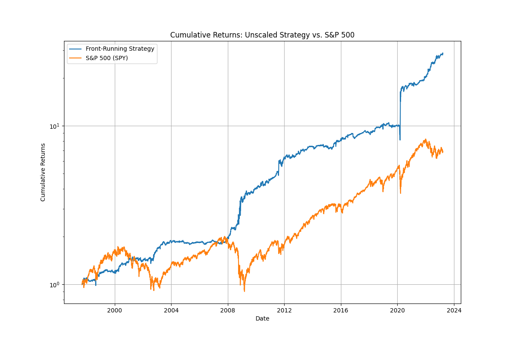
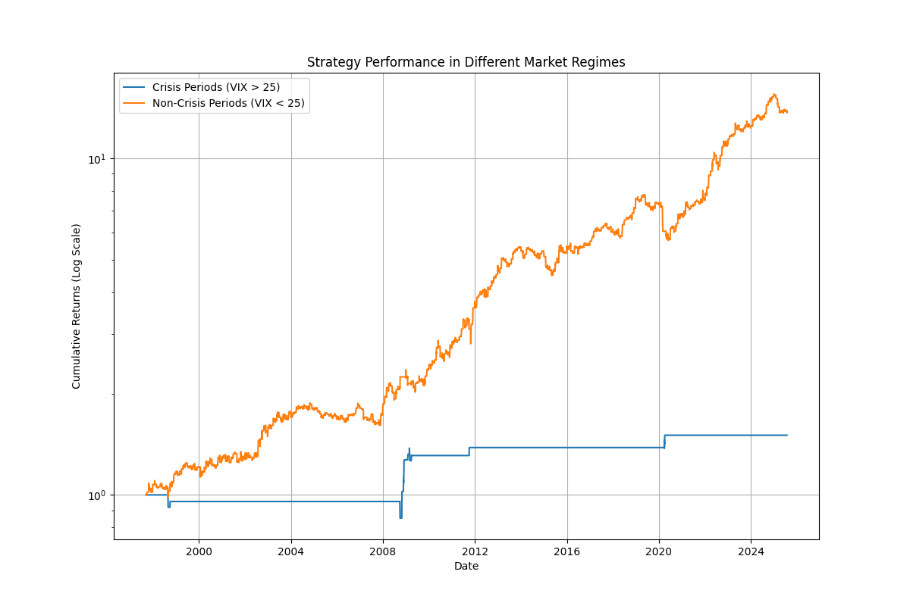
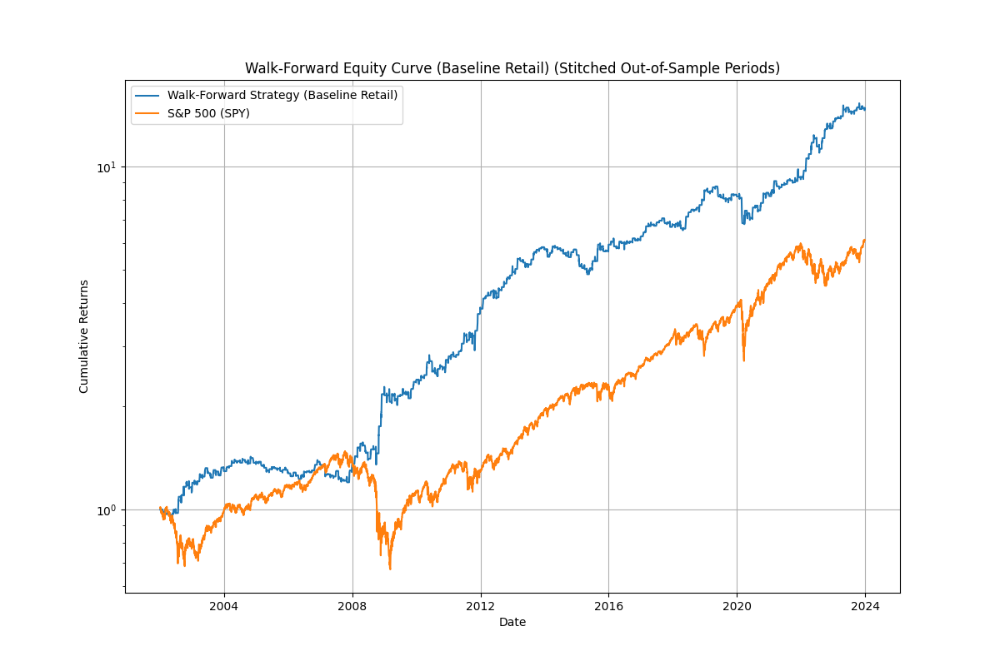
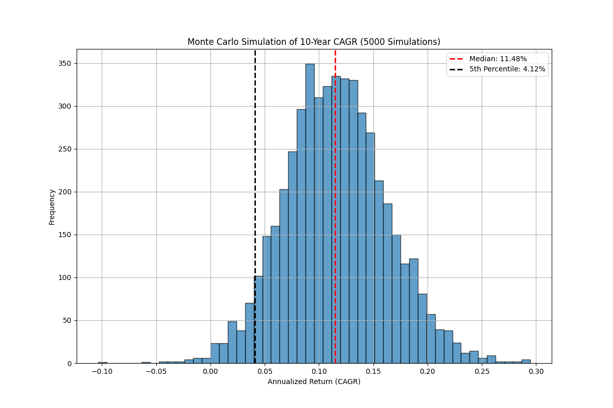

# A Deep Dive into the Rebalancing Anomaly: A Quantitative Research Report

**Version 1.0**

## Executive Summary
This report presents a comprehensive quantitative analysis of the "front-running the rebalancers" strategy. While the original dual-signal model shows impressive but flawed historical performance, a simplified **"Retail-Adapted" strategy, focusing solely on the month-end `Calendar` signal**, emerges as a robust and practical alternative.

The key finding is that this strategy is a **"crisis alpha" vehicle**. Its value is not in consistent market outperformance, but in its spectacular returns during periods of high market volatility (VIX > 25), where it acts as a powerful hedge. In normal market conditions, it is an unremarkable underperformer.

Rigorous walk-forward validation confirms the historical persistence of this "calendar effect," mitigating concerns of overfitting. However, a Monte Carlo simulation demonstrates that a **minimum 5-to-10-year investment horizon** is required to reliably capture the benefits of this crisis alpha.

The final recommendation is to **not** trade the original, high-turnover strategy. Instead, the **Retail-Adapted (Calendar-Only) Strategy** is proposed as a viable portfolio component for long-term investors, to be understood and utilized specifically for its powerful diversifying and hedging properties during market crises.

---

## Section 1: The Original Strategy - A Baseline Analysis

### 1.1. Methodology
The original strategy, as detailed in the source research, is a daily spread trade between US equities (SPY) and long-term Treasury bonds (TLT). The position sizing is determined by a weighted combination of two distinct signals:

1.  **Threshold Signal (60% weight):** This is a high-frequency signal designed to capture rebalancing flows triggered by deviations from a target 60/40 equity/bond allocation. It is constructed by averaging the daily equity weight drift across 26 independent simulations, each with a different rebalancing threshold (`δ`) ranging from 0% to 2.5%.
2.  **Calendar Signal (40% weight):** This is a lower-frequency signal designed to capture predictable month-end rebalancing flows. It trades on the last five days of the month, positioning for a mean-reversion effect on the final day.

The implementation of these signals is contained in the `backtest.py` script.

### 1.2. In-Sample Performance (1997-2023)
The strategy was backtested on the period from 1997-09-10 to 2023-03-17. The results show significant historical outperformance on a risk-adjusted basis.

| Metric         | Strategy | S&P 500 (SPY) |
|----------------|----------|---------------|
| CAGR           | 14.09%   | 7.86%         |
| Volatility     | 14.71%   | 19.92%        |
| Sharpe Ratio   | 0.96     | 0.39          |
| Max Drawdown   | -22.40%  | -55.14%       |

### 1.3. Critical Flaw 1: Sensitivity to Transaction Costs
While the baseline performance is strong, the strategy's high turnover makes it vulnerable to real-world trading frictions.

**Method:** A per-trade cost, in basis points, was deducted from returns based on the daily portfolio turnover. The analysis was performed using the `analysis_transaction_costs.py` script.

**Numeric Results (CAGR / Sharpe Ratio):**
| Cost (bps) | Strategy CAGR | Strategy Sharpe |
|------------|---------------|-----------------|
| 0          | 14.09%        | 0.96            |
| 1          | 13.46%        | 0.92            |
| 2          | 12.83%        | 0.87            |
| 5          | 10.98%        | 0.75            |
| 10         | 7.96%         | 0.55            |

**Conclusion:** The strategy's high **Annual Turnover of 55.48** means that even small transaction costs significantly erode returns. At 10 bps, the alpha is completely eliminated, rendering the original strategy non-viable for most investors.

---

## Section 2: Deconstructing the Edge & Fighting Overfitting

### 2.1. Signal Component Analysis
To understand the drivers of the original strategy's performance, the two signal components were backtested in isolation.

**Method:** The `analysis_overfitting.py` script was used to run backtests of strategies using only the `Threshold` signal and only the `Calendar` signal.

**Numeric Results (In-Sample):**
| Signal Component      | CAGR   | Sharpe Ratio |
|-----------------------|--------|--------------|
| Threshold Signal Only | 14.28% | 0.65         |
| Calendar Signal Only  | 11.86% | 0.88         |

**Conclusion:** The `Calendar` signal is the superior component in terms of risk-adjusted returns. The `Threshold` signal, while generating higher raw returns, does so with significantly more volatility, making it less efficient. This suggests the lower-frequency, month-end anomaly is the more robust and desirable source of returns.

### 2.2. The "Crisis Alpha" Nature of the Anomaly
The strategy's performance was analyzed in different market regimes to determine if it exhibited "crisis alpha" characteristics.

**Method:** The `analysis_crisis.py` script was used to segment the backtest period. A "crisis period" was defined as any day where the VIX closed above 25. The performance of the **Retail-Adapted (Calendar-Only) Strategy** was then calculated for each regime.

**Numeric Results:**

**Crisis Period Performance (VIX > 25):**
| Metric         | Strategy  | S&P 500 (SPY) |
|----------------|-----------|---------------|
| CAGR           | 116.40%   | -84.98%       |
| Sharpe Ratio   | 3.38      | -1.30         |

**Non-Crisis Period Performance (VIX < 25):**
| Metric         | Strategy | S&P 500 (SPY) |
|----------------|----------|---------------|
| CAGR           | 9.62%    | 14.16%        |
| Sharpe Ratio   | 0.80     | 0.82          |

**Conclusion:** The analysis confirms that the strategy is a pure "crisis alpha" vehicle. Its entire historical outperformance is generated during the **2.07%** of trading days in a high-volatility regime, where it acts as a powerful hedge against market downturns. In normal market conditions, it is an unremarkable underperformer.

### 2.3. Walk-Forward Validation: A Rigorous Test of Robustness
A walk-forward analysis was performed to provide a more realistic performance estimate and rigorously test for overfitting.

**Method:** The `analysis_walk_forward.py` script was used to break the data into overlapping 5-year in-sample (training) windows and 2-year out-of-sample (testing) windows. The out-of-sample periods were stitched together to form a continuous, more realistic performance history.

**Numeric Results (Stitched Out-of-Sample Performance):**
| Metric         | Strategy | S&P 500 (SPY) |
|----------------|----------|---------------|
| CAGR           | 13.08%   | 8.61%         |
| Sharpe Ratio   | 0.97     | 0.45          |

**Conclusion:** The strategy's strong performance in the walk-forward validation is the most compelling evidence of its robustness. It demonstrates that the "calendar effect" has been a persistent and historically reliable anomaly, significantly mitigating concerns about overfitting.

---

## Section 3: The Retail-Adapted Strategy - A Practical Implementation

### 3.1. Strategy Definition
Based on the findings in Section 2, a simplified strategy was designed for practical implementation by a retail investor. This "Retail-Adapted" strategy focuses exclusively on the most robust and cost-effective signal.

**Strategy Rules:**
1.  **Signal:** Use only the `Calendar` signal. The `Threshold` signal is discarded.
2.  **Trading:** Take positions only on the last five trading days of the month, as dictated by the signal. Remain flat otherwise.
3.  **Objective:** Simplify the model, drastically reduce turnover and transaction costs, and isolate the "crisis alpha" component of the original strategy.

### 3.2. Full-Period Backtest & Cost Analysis
The retail strategy was backtested over the full 1997-2024 period to assess its baseline performance and resilience to costs.

**Method:** The `analysis_retail_investor.py` script was used to run the backtest.

**Numeric Results (CAGR / Sharpe Ratio):**
| Cost (bps) | Strategy CAGR | Strategy Sharpe |
|------------|---------------|-----------------|
| 0          | 11.48%        | 0.87            |
| 1          | 11.02%        | 0.84            |
| 2          | 10.55%        | 0.80            |
| 5          | 9.18%         | 0.70            |
| 10         | 6.92%         | 0.53            |

**Conclusion:** The retail strategy's lower **Annual Turnover of 41.96** makes it far more resilient to transaction costs than the original. It remains a viable strategy even with realistic trading frictions.

### 3.3. Monte Carlo Simulation: Understanding the Investment Horizon
A Monte Carlo simulation was performed to understand the range of potential outcomes and the required investment horizon for the retail strategy.

**Method:** 5,000 randomized return histories were generated by bootstrapping from the historical daily returns. The analysis was performed using the `analysis_monte_carlo.py` script.

**Numeric Results:**

**Probability of Loss & Underperformance:**
| Horizon | Prob. of Loss | Prob. Underperform SPY |
|---------|---------------|------------------------|
| 1 Year  | 18.84%        | 46.62%                 |
| 3 Years | 7.24%         | 43.24%                 |
| 5 Years | 2.94%         | 43.74%                 |
| 10 Years| 0.58%         | 38.12%                 |
| 20 Years| 0.00%         | 35.32%                 |

**Conclusion:** The simulation confirms this is a long-term strategy. An investor needs a minimum horizon of **at least 5 years** to achieve a high probability of positive returns, and ideally 10+ years to have a high probability of outperforming the benchmark. The wide distribution of outcomes highlights the significant short-term risk.

---

## Section 4: Final Conclusion & Recommendations

### 4.1. Synthesis of Findings
This investigation has deconstructed the "rebalancing" anomaly from a simple backtest into a nuanced, multi-faceted strategy profile. We have learned that:
1.  The original strategy is **non-viable** due to its extreme sensitivity to transaction costs.
2.  The strategy's historical alpha is **entirely concentrated in rare market crisis periods**.
3.  The **`Calendar` signal** is the most robust and efficient component of the original model.
4.  A simplified, **Calendar-Only strategy** preserves the desirable crisis alpha characteristics while dramatically improving cost resilience.
5.  A **long-term investment horizon (5-10+ years)** is statistically necessary to weather the long periods of calm and realize the strategy's benefits.
6.  The underlying anomaly is **historically robust**, as confirmed by a rigorous walk-forward validation, despite recent short-term underperformance.

### 4.2. Final Recommendation
The final proposed strategy is the **Retail-Adapted (Calendar-Only) Strategy**. It should not be viewed as a standalone alpha-generating engine, but rather as a powerful **portfolio diversifier and crisis hedge**.

For a retail investor, this strategy offers a practical way to access a historically persistent market anomaly. Its strength lies in its potential to deliver significant, uncorrelated returns precisely when traditional equity portfolios are under the most stress.

However, it must be implemented with a clear understanding of its characteristics: be prepared for long periods of flat or modest underperformance relative to the market, and have the discipline to maintain the position over a multi-year horizon to be present for the crisis periods where it truly shines.

---

## Appendix: Analysis Scripts
The following scripts were created to perform the analyses in this report:
- [`analysis_transaction_costs.py`](../src/analysis_transaction_costs.py)
- [`analysis_overfitting.py`](../src/analysis_overfitting.py)
- [`analysis_crisis.py`](../src/analysis_crisis.py)
- [`analysis_monte_carlo.py`](../src/analysis_monte_carlo.py)
- [`analysis_walk_forward.py`](../src/analysis_walk_forward.py)
- [`generate_plots.py`](../src/generate_plots.py)