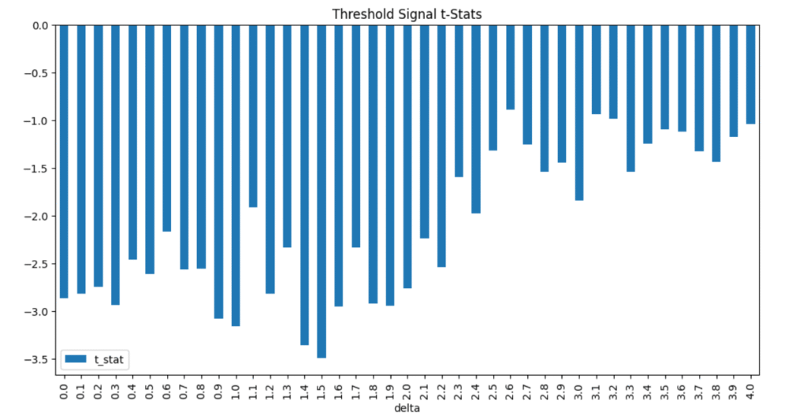
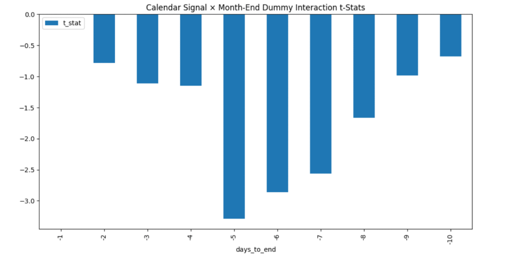
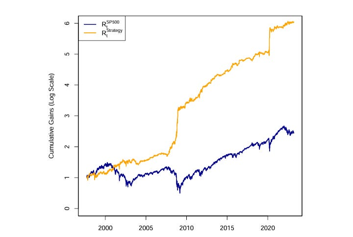
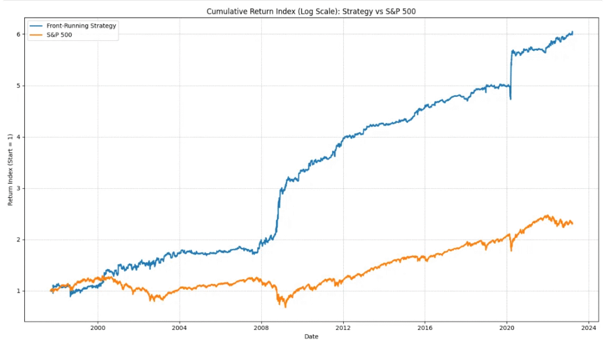
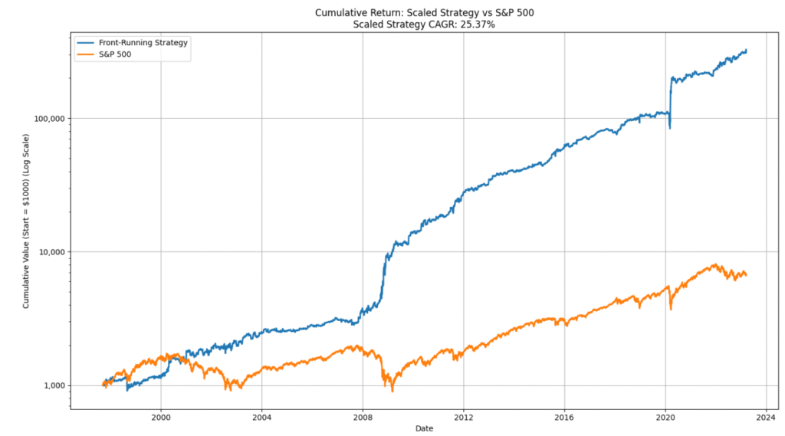
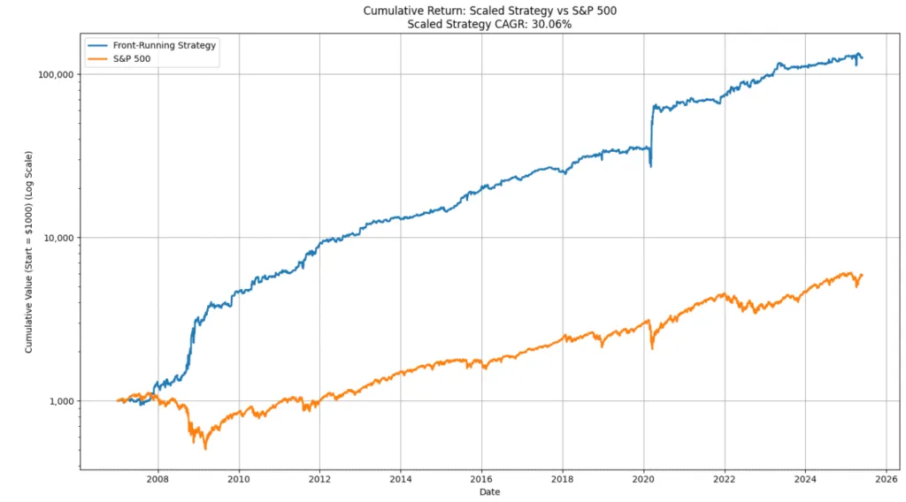
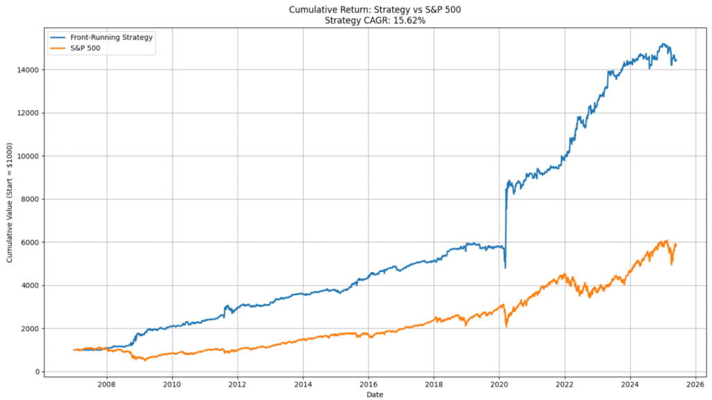

[Skip to content](https://quantreturns.com/strategy-review/front-running-the-rebalancers/#wp--skip-link--target)

# The Unintended Consequences of Rebalancing

[Jul 3, 2025](https://quantreturns.com/strategy-review/front-running-the-rebalancers/)

—

by

[admin](https://quantreturns.com/author/admin/)

in [Strategy Review](https://quantreturns.com/category/strategy-review/)

## The Premise

While much of the research in modern markets has focused on persistent forces like momentum, value, or macro news, relatively little attention has been given to mechanical rebalancing.

Every month, asset managers across the globe realign portfolios to target weights: 60/40, risk parity, vol targeting, and everything in between. These flows are large, predictable and if you squint hard enough, front-runnable.

In this post, we focus on one of the most well-known and widely implemented allocations: the **60/40 portfolio** — 60% equities, 40% bonds. Specifically, we’re interested in what happens when that balance drifts and money managers are forced to rebalance.

The idea comes from _“The Unintended Consequences of Rebalancing”_, a paper by Campbell R. Harvey, Michele G. Mazzoleni, and Alessandro Melone (2025), which explores how predictable equity-bond rebalancing activity may create short-term price pressures and how those flows might be front-run or faded systematically.

We’re not going to attempt to replicate their results to the decimal point. This isn’t about academic fidelity. Instead, we’re using the paper as a launchpad — a way to identify and extract the core edge buried in the data. If that edge holds up, we’ll trade it. If not, we walk away. But the goal here isn’t replication for its own sake, it’s **edge discovery for practical trading**.

## The Idea

Institutional portfolios anchored to a 60/40 equity-bond split must periodically rebalance. When market moves cause the allocation to drift from its target, rebalancing flows are triggered to bring it back in line. These rebalances can occur monthly or when certain thresholds are breached — both of which are often predictable.

At its core, this study explores whether we can position ourselves in **S&P 500 futures** (for equities) and **10-Year Treasury futures** (for bonds) in such a way as to front-run the rebalancing activity of 60/40 portfolios.

That’s the hypothesis. Let’s extract the edge.

We will explore the rebalancing that can occur as a result of a :

- **Threshold-based** **signal** — triggered when portfolio equity allocation has a significant weight deviation from 60 target.
- **Calendar-based** **signal**— triggered at a certain time of the month such as end-of-month or quarter

These flows aren’t discretionary. They’re mechanical. That’s what makes them potentially tradable.

So our investigation begins with a simple question:

**Can we anticipate and trade around these rebalancing signals using futures**?

If either one reliably predicts equity-bond return spreads, we may be looking at a tradable edge.

## The Edge

Let’s pause here, because this part matters.

The edge is everything.

It’s the foundation of any real trading strategy, it is the anomaly in the data that gives rise to alpha. Without it, a strategy is just a random set of rules. But once you extract an edge, you’ve got something you can structure a system around.

We’re not aiming for academic purity here. The data we use is different, and implementation requires some level of interpretation. What we are aiming for is simple: extract the edge the paper hints at, validate that it still exists, and then build rules to capture it.

We started with the threshold signal.

### Threshold Signal

- **Definition**: The Threshold Signal measures the deviation of the current equity holding from 60%. When the deviation goes over a certain threshold, the portfolio is rebalanced back to 60%.
- **Hypothesis**: A negative signal today indicates an increase in the Equity-Bond spread the next trading day.

The logic behind the hypothesis is simple: a negative signal today means equities are underweight. To rebalance, traders will likely sell bonds and buy equities tomorrow, pushing the equity-bond spread higher.

So we need to regress the following equation to see if a relationship exists:

r<sup>ES-ZN</sup><sub>t+1</sub> = α + β(δ) ⋅ ThresholdSignal<sup>(δ)</sup><sub>t</sub> + ε<sub>t</sub>

Where:
- r<sup>ES-ZN</sup><sub>t+1</sub> is the next-day return spread between S&P 500 and 10-Year Treasury futures
- δ represents the specific threshold value (e.g., 0.5%, 1%, 2%, etc.)
- ThresholdSignal<sup>(δ)</sup><sub>t</sub> is the signal at time t constructed using threshold δ
- β(δ) captures the predictive strength at that threshold level

Before we begin our regression, we need to decide what **threshold value** **(δ)** to use to trigger a rebalance.

Rather than assume a specific **threshold value**, we take a more empirical approach — testing a **range of values** to see which levels produce a statistically significant predictive threshold signal.

We then regress each of these threshold signals against **tomorrow’s equity–bond return spread** to evaluate their predictive power.

Following the structure of the original paper, we test a range of δ values from **0% to 4%**. The results are presented below.


*A bar chart titled "Threshold Signal t-Stats" shows the t-statistic for various delta values (from 0.0 to 4.0) on the x-axis. The y-axis represents the t-stat value. The bars are all negative, with the most significant t-stats (more negative) occurring for delta values between 0% and 2%. For instance, at a delta of 1.5, the t-stat is approximately -3.5.*

The strongest t-stats appear in the range between **0% and 2%** deviation — beyond that, the signal fades. This aligns with the intuition that rebalancing is more likely when the portfolio is slightly off target, but not excessively so.

Given we don’t want to use any particular threshold value, we build a new **Average Threshold Signal**, combining all threshold signals from 0% to 2%. This smooths out any individual noise and focuses on the region with the most consistent predictive value.

We then regress this average signal against **next-day equity–bond return spreads** to test we still have a statistically significant signal. The t-stat of -3.248 shows this **Average Threshold Signal** is even greater than the previous individual threshold signals.

```
Avg Threshold Signal t-stat: -3.2476902933971394
                            OLS Regression Results
==============================================================================
Dep. Variable:          lead_ret_diff   R-squared:                       0.004
Model:                            OLS   Adj. R-squared:                  0.004
Method:                 Least Squares   F-statistic:                     10.55
Date:                Wed, 02 Jul 2025   Prob (F-statistic):            0.00117
Time:                        17:10:36   Log-Likelihood:                  18974.
No. Observations:                6406   AIC:                        -3.794e+04
Df Residuals:                    6404   BIC:                        -3.793e+04
Df Model:                           1
Covariance Type:                  HC3
========================================================================================
                           coef    std err          z      P>|z|      [0.025      0.975]
----------------------------------------------------------------------------------------
const                    0.0002      0.000      1.253      0.210      -0.000       0.001
avg_threshold_signal    -0.1974      0.061     -3.248      0.001      -0.316      -0.078
==============================================================================
Omnibus:                      996.558   Durbin-Watson:                   2.031
Prob(Omnibus):                  0.000   Jarque-Bera (JB):            13698.765
Skew:                          -0.282   Prob(JB):                         0.00
Kurtosis:                      10.142   Cond. No.                         245.
==============================================================================
```

This confirms that **moderate equity-weight deviations in a 60/40 portfolio can reliably predict short-term return** — providing us with a clean, tradeable signal.

> When equities are underweight, the signal is negative → we expect equities to be bought tomorrow → the strategy goes **long equities, short bonds**.

### Calendar Signal

- **Definition**: The Calendar Signal captures the timing tendency of institutional rebalancing, based on the idea that many asset managers rebalance at fixed intervals. This signal measures the deviation of the equity allocation of a portfolio to the target 60% and rebalances on back to 60/40 on the last day of the month.
- **Hypothesis**: A negative signal closer to month end indicates an increase in the Equity-Bond spread the next trading day.

The logic behind the hypothesis is institutions typically rebalance near month-end, so traders may begin front-running those flows in the final days of the month. We are looking for a negative calendar signal during these periods which suggests equity allocation is currently below 60%, and so expect equities will be bought and bonds sold, increasing the equity-bond spread tomorrow.

We test various rebalancing days towards the end of the month, using linear regression similar to what was performed for the Threshold Signal.


*A bar chart titled "Calendar Signal × Month-End Dummy Interaction t-Stats" shows the t-statistic for the number of days to the end of the month on the x-axis (from -1 to -10). The y-axis represents the t-stat value. The t-stats are all negative, becoming most significant around 5-7 days before the month's end, with the t-stat at day -5 being the lowest at approximately -3.3.*

The chart above shows how strongly the calendar signal predicts the next day’s equity–bond return spread, based on how many trading days are left in the month. For example, if the x-axis shows “5,” we’re testing how predictive the signal is **during the four trading days leading up to — but not including — the final day of the month**. In other words, it’s five days to month-end, but we’re excluding the last day itself from the regression window. Why? Because by the final day, most of the rebalancing flows we’re trying to front-run have likely already hit. At that point, the edge flips. Instead of expecting more directional pressure, we’re often looking for a reversal. That’s why the last trading day isn’t part of the predictive window — it’s the day we use to **position for mean reversion**. As you’ll see in the strategy section, we assume that any forced buying or selling has mostly run its course by then. And like a coiled spring, prices are primed to snap back to their mean.

## The Strategy

Now that we’ve shown both the threshold and calendar signals contain predictive power, it’s time to do something with them. Section 5 of the paper pulls it all together into a **daily trading strategy**, and we’re going to follow that structure.

The strategy trades the **equity-bond spread** — going long equities and short bonds (or vice versa) using futures, based on the strength of the combined signal. What this means is, the stronger the signal, the larger the weight of our spread position.

Here’s how it works: we first **modify each of the signal** s, we then combine each of the modified signals together in a linear fashion, to create a single daily strategy weight. We then apply that weight to the equity-bond futures spread. Here’s the step-by-step breakdown:

#### Modified Threshold Signal

We take the **Average Threshold Signal** and make it usable in our strategy by rescaling it.

We convert it into the **Modified Threshold Signal** by simply dividing the output of the Average Threshold Signal by a normalization constant (0.012), and inverting the sign. We invert the sign since a negative signal implies a positive weight for the strategy (we discuss this more in the **Position & Return Calculation** section below).

#### Modified Calendar Signal

We take the **Calendar Signal** output and make the signal zero for all days accept for the **last five trading days of each month**. During the 4 days leading up to the final day of the month, we assign a value of -1 if the signal is positive and +1 if the signal is negative. On the final day of the month, after all the rebalancing price pressure has finished, we assign the inverse value to that of 5th last trading day of the previous month. We do this to position ourselves to take advantage of the expected mean reversion that happens during trading on the the first day of the month.

#### Combining the Signals into a Strategy Weight

Each of the signals discussed above captures a different source of rebalancing pressure and we combine them together to create a weight for our strategy:

Strategy Weight<sub>t</sub> = 0.6 ⋅ Modified Threshold Signal<sub>t</sub> + 0.4 ⋅ Modified Calendar Signal<sub>t</sub>

This combined weight determines how aggressively we position in the **equity-bond spread** (long S&P 500 futures, short 10-year Treasury futures).

#### Position & Return Calculation

We take this strategy weight and apply it to the return difference between equity and bond futures:

Strategy Return<sub>t</sub> = Strategy Weight<sub>t-1</sub> ⋅ (Return<sub>ES,t</sub> - Return<sub>ZN,t</sub>)

- A **positive weight** means we’re long equities, short bonds.
- A **negative weight** means we’re long bonds, short equities.
- A **zero weight** means we stay flat.

Before diving into the strategy mechanics, let’s first compare our equity curve to the one published in the original paper.


*This is Figure 4 from the original paper, showing the cumulative gains on a log scale. The orange line, representing the strategy, shows significantly higher cumulative returns compared to the S&P 500 (dark blue line) over the period from roughly 1998 to 2021.*


*This chart shows the QuantReturns.com replication of the strategy. It plots the cumulative return index (starting at 1) on a log scale versus the S&P 500. The "Front-Running Strategy" (blue line) consistently outperforms the S&P 500 (orange line) over the same period.*

> The resemblance above is encouraging, our replication tracks the paper’s performance closely, which suggests we’ve captured the essence of the strategy well. With that validation in place, let’s move on to a deeper analysis of the results.

The below table shows the key performance statistics of the QuantReturns implementation of the strategy compared to the SPY ETF benchmark which acts as a proxy to the S&P 500.

| **Metric** | **Strategy** | **S&P 500** (SPY) |
| --- | --- | --- |
| **Start Date** | 1997-09-10 | 1997-09-10 |
| **End Date** | 2023-03-17 | 2023-03-17 |
| **Initial Value** | $1,000.00 | $1,000.00 |
| **Final Value** | $7,312.84 | $6,726.89 |
| **CAGR** | 8.11% | 7.76% |
| **Volatility** | 6.51% | 19.94% |
| **Sharpe Ratio** | 1.24 | 0.48 |
| **Max Drawdown** | –8.90% | –55.19% |
| **Skew** | 4.53 | –0.03 |
| **Beta (Benchmark)** | 0.07 | – |

We now scale the strategy to match the volatility of the S&P 500, and observe the equity curve of the strategy and it’s key statistics:


*A line chart titled "Cumulative Return: Scaled Strategy vs S&P 500" with a log scale on the y-axis (Cumulative Value, Start = $1000). The "Front-Running Strategy" (blue line) shows a cumulative return reaching over $100,000, while the S&P 500 (orange line) reaches around $7,000 over the period from late 1997 to early 2024. The scaled strategy's CAGR is 25.37%.*

| **Metric** | Scaled **Strategy** | **S&P 500** (SPY) |
| --- | --- | --- |
| **Start Date** | 1997-09-10 | 1997-09-10 |
| **End Date** | 2023-03-17 | 2023-03-17 |
| **Initial Value** | $1,000.00 | $1,000.00 |
| **Final Value** | $319,956.41 | $6,726.89 |
| **CAGR** | 25.37% | 7.76% |
| **Volatility** | 19.94% | 19.94% |
| **Sharpe Ratio** | 1.24 | 0.48 |
| **Max Drawdown** | –25.39% | –55.19% |
| **Skew** | 4.53 | –0.03 |
| **Beta (vs. S&P 500)** | 0.07 | – |

**Does the strategy still work today?**

One natural question is whether this inefficiency has persisted or been arbitraged away by now. To find out, we backtested between 2007 and June 2025 to see if the edge still holds up. Here are the updated performance figures for the scaled strategy:


*A line chart titled "Cumulative Return: Scaled Strategy vs S&P 500" for the period from 2007 to mid-2025. The y-axis is on a log scale (Cumulative Value, Start = $1000). The "Front-Running Strategy" (blue line) shows a cumulative return of over $100,000, while the S&P 500 (orange line) is below $10,000. The scaled strategy's CAGR is 30.06%.*

| **Metric** | Scaled **Strategy** | **S&P 500** (SPY) |
| --- | --- | --- |
| **Start Date** | 2007-01-03 | 2007-01-03 |
| **End Date** | 2025-06-01 | 2025-06-01 |
| **Final Value** | $125,954.23 | $5,878.73 |
| **CAGR** | 30.06% | 10.10% |
| **Volatility** | 19.98% | 19.98% |
| **Sharpe Ratio** | 1.42 | 0.58 |
| **Max Drawdown** | -25.00% | -55.19% |
| **Skew** | 5.14 | 0.0035 |
| **Beta (Benchmark)** | 0.02 | – |

Even in the more recent period, the strategy continues to outperform on a risk-adjusted basis, with a Sharpe ratio more than double that of the S&P 500 and a remarkably low beta of 0.07. This suggests that the edge is still alive—and possibly still underexploited.

> Notably, the strategy shows a Sharpe Ratio greater than **1.4** and a strong positive skew of **5.14**, suggesting a tendency toward large upside outliers — a characteristic that enhances long-term compounding and is rarely found in high-Sharpe strategies.

So far, the results suggest that this strategy – when implemented with futures— continues to perform well, even in today’s market. But the next natural question is: **can this edge be captured using more accessible instruments like ETFs?** To explore that, we tested the same approach using **SPY** (for equities) and **TLT** (for long-term bonds) as ETF proxies. While ETFs come with different liquidity profiles, intraday trading constraints, and tracking mechanics compared to futures, they offer a practical path for implementation by a broader range of investors. Let’s take a look at how the strategy holds up when applied to these instruments.


*A line chart titled "Cumulative Return: Strategy vs S&P 500" using ETFs, with a linear y-axis (Cumulative Value, Start = $1000). The "Front-Running Strategy" (blue line) reaches a cumulative value of over $14,000, while the S&P 500 (orange line) reaches just under $6,000 from 2007 to mid-2025. The strategy's CAGR is 15.62%.*

| **Metric** | ETF **Strategy** | **S&P 500** (SPY) |
| --- | --- | --- |
| **Start Date** | 2007-01-03 | 2007-01-03 |
| **End Date** | 2025-06-01 | 2025-06-01 |
| **Initial Value** | $1,000.00 | $1,000.00 |
| **Final Value** | $14,458.73 | $5,878.73 |
| **CAGR** | 15.62% | 10.10% |
| **Volatility** | 13.13% | 19.98% |
| **Sharpe Ratio** | 1.17 | 0.58 |
| **Max Drawdown** | –19.71% | –55.19% |
| **Skew** | 7.07 | 0.01 |
| **Beta (Benchmark)** | 0.12 | – |

Encouragingly, when applying the same strategy using **ETFs like SPY and TLT**, the results remained robust. Over the long run, the ETF-based version delivered a **CAGR of 15.62%** with a **Sharpe ratio of 1.17**, and still maintained the hallmark features of the futures-based strategy: low drawdown, low beta, and strongly **positive skew (7.07)**. This suggests that even without futures, the underlying edge can still be accessed—making it far more practical for a wider range of investors.

## Final Thoughts

This strategy doesn’t rely on forecasting fundamentals, chasing momentum, or reacting to news. Instead, it focuses on something simpler and arguably more persistent: predictable, mechanical flows.

By understanding when and why large allocators are forced to rebalance, we can position ahead of them, exploiting structural pressure without needing to predict the direction of the market.

It’s a strategy built not on opinion, but on observable behaviour and one that continues to show signs of strength.

Over the next few weeks, we’ll be spending some time adding this strategy to the [QuantReturns.com](https://app.quantreturns.com/portfolios) strategy library, so you can track its daily performance.

In a future post, we’ll explore refinements, alternative signal weightings and potential ways to improve our results. But for now, the takeaway is clear:

**Sometimes, knowing when someone else** _**has**_ **to trade is the best edge you can have.**

**Disclaimer**

_This website provides an assessment of the market and economic environment at a specific point in time. It is not intended as a forecast of future events or a guarantee of future results. The content is meant to present ideas for further research and analysis and should not be interpreted as a recommendation to invest._

_This material does not provide individualized advice or recommendations for any specific reader. Forward-looking statements are subject to risks and uncertainties, and not all relevant risks related to the ideas presented may be covered. Actual results, performance, or achievements may differ materially from those expressed or implied._

_The information is based on data gathered from sources we believe to be reliable. However, its accuracy is not guaranteed, it does not purport to be complete, and it should not be used as a primary basis for investment decisions._

_Readers are encouraged to conduct their own due diligence and consider their individual investment objectives, risk tolerance, time horizon, tax situation, liquidity needs, and portfolio concentration. Consulting with a professional adviser is recommended to determine whether the ideas presented here are suitable for your unique circumstances._

_By using the information in this article, you agree that the author and publisher are not liable for any direct or indirect losses resulting from your use of the material._